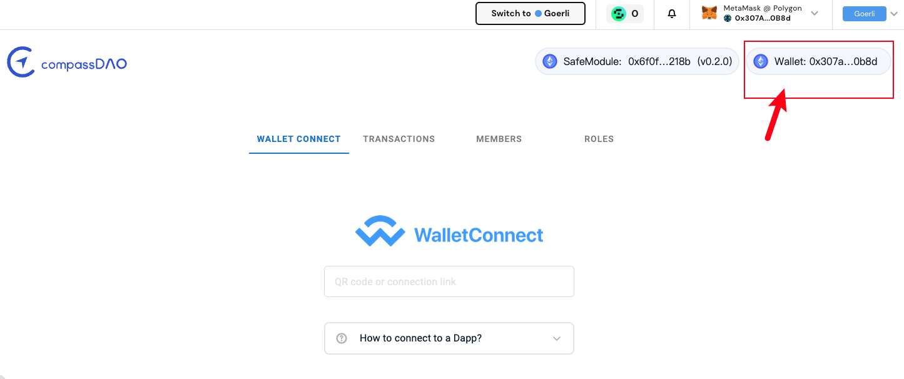

# FAQ

* _When I'm sining a transaction, I got the error message: <mark style="color:red;">'Tip: There might be an error. Please check if the current member (0x...) has the permission.'</mark>_&#x20;
  *   _check if your connecting to the correct wallet(authorized member), if not, disconnect the incorrect wallet and re-connect again._

      &#x20;

      <figure><figcaption></figcaption></figure>

      <figure><figcaption></figcaption></figure>
  * _check if the current member has the corresponding permissions (view the role details)_

* There's no error message, I sign the transaction in Metamask, but the transaction seems failed and cannot be found in transaction list.&#x20;
  * check if you gave enough gas limit and gas price
