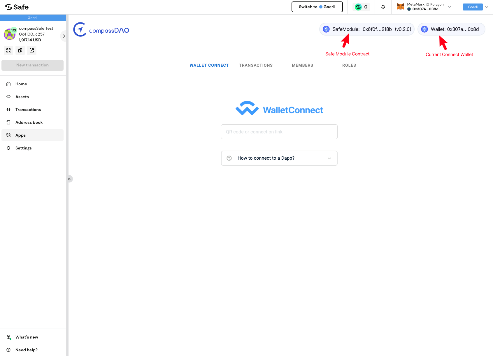

# Interact With Dapps

When all the configuration is done, you can now use the app to interact with any Dapps (DeFi, NFT, Web3 projects, etc.)

Note: If it's the first time for your member to use the app, he/she needs to bind the Safe&#x20;

_**1.Go to the Dapp you want to use, here we take Etherscan as a sample. Click on "Connect Wallet", select "WalletConnect".**_

<figure><figcaption></figcaption></figure>

_**2.Then you'll get a pop-up window with a QR code, there's a line "Copy to clipboard" below the QR code, click to copy it.**_

<figure><figcaption></figcaption></figure>

_**3.Back to our app, go to "WALLET CONNECT" tab, paste the code you just copied in the input field.**_

<figure><figcaption></figcaption></figure>

_**4.Now the app is connected, you can initiate any transaction in Dapps (e.g. Etherscan), and you'll get the request here.**_

<figure><figcaption></figcaption></figure>

_**5.Check carefully with all the details of the transaction, click on "CONFIRM" to sign it with your metamask.**_

<figure><figcaption></figcaption></figure>

Note: If the current member(connected metamask wallet) does not have the corresponding permission, the transaction will be failed.

_**6.Later you can find the transactions you signed with our app in "TRANSACTION" tab, click on "View" to see the parsed details of the transaction.**_

<figure><figcaption></figcaption></figure>
